# PROJECT Design Documentation

## Team Information

* Team name: s2a-Momo
* Team members
  * Shubhang Mehrotra (sm9943)
  * Joel Clyne (jmc4514)
  * Sasha Persaud (srp4581)
  * Quynh Duong
  * Dmitry Selin (des3358)

## Executive Summary

The Online WebCheckers project is a Web-based application which aims to provide its users with the functionality to play 
checkers online and in real-time, against any other online player. To achieve the functionality, the system has been 
designed on Spark Framework with a FreeMarker Template. The bedrock of the application is formed of Java, Javascript, 
HTML and CSS.

### Purpose

This projects aims to deliver a fun and engaging experience to a broad range of users who wish to play an online version
of the classic checkers game. This project was commissioned by the "WebCheckers Startup", that aims to provide users the
ability to sign in, play a game of checkers, and sign out at will.

### Glossary and Acronyms

| Term | Definition |
|------|------------|
| VO | Value Object |
| PR | Player |
| OP | Opponent |
| PL | Player Lobby |
| APP | Application |

## Requirements

This section describes the features of the APP.

Users must be able to sign in to the website with a username of their choice. After signing in, users must be able to
choose an OP for a checkers game. The program must connect the two PRs together and set up a WebCheckers game in 
accordance to the American Rules. The APP must display all the components and information of the checkers board, just as 
if it was viewable in real-life. The PRs must be able to resign from the game at any point. If no PR resigns, the game 
continues until a winner is determined. An additional modification that is also to be made is Replay Mode - PRs would be 
able to save their previous games and play them back through a Replay Mode from the home screen.

### Definition of MVP

The MPV of this APP entails that the program has the following features: users can sign in with a unique name of their 
choice, two users can play a game of Checkers according to the American Rules, and users can sign-out/resign at any 
point, which would end the game. Additionally, an essential, but non-MVP feature that is to be implemented is Replay
Mode - which would allow users to replay previously played checkers games from their home screen.

### MVP Features

* Connection - Server/Client logic
* Display - Graphical Display of the state of the game
* Possible Moves - Checkers game logic
* Replay Mode - Save and replay previously played checkers games

### Roadmap of Enhancements

* Sign-In - Users are given the ability to sign in to the APP with a username of their choice.
* Start a Game - Users are able to start a checkers game.
* Connection - Major Server/Client communication is defined.
* Game Logic - Rules and processes for the checkers game are defined.
* Display - Basic graphical/visual components are created to display information regarding the game.
* Replay Mode - Allows users to save and replay previously played games

## Application Domain

This section describes the APP domain.

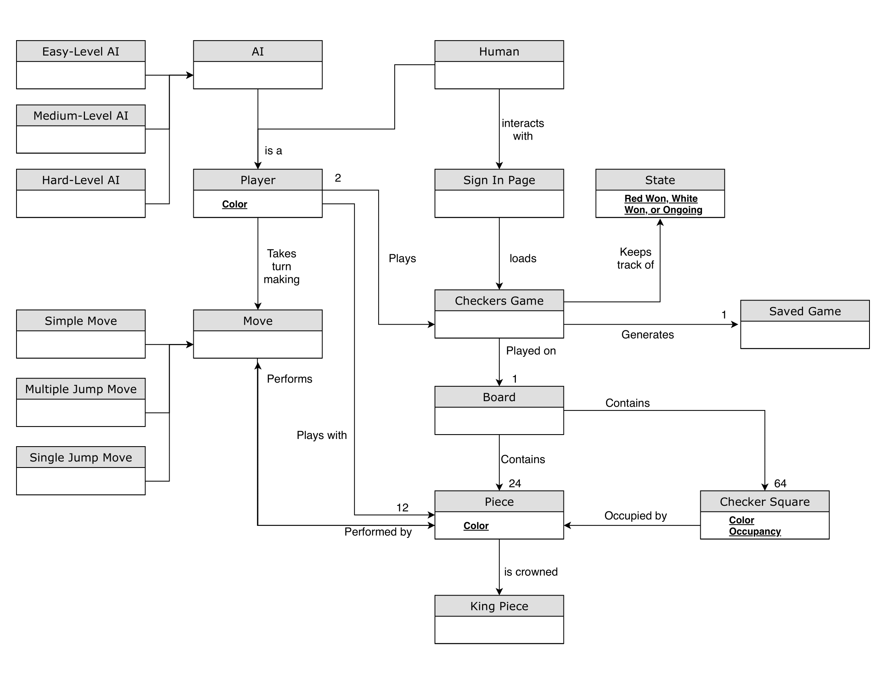

The PR is represented on the domain model as an entity that plays the checkers game and takes turns making 
moves that could either be a simple, single-jump, or multiple-jump move. Each move is performed by a Piece that is on 
the checkers board via a checkers square (or Space). Each checkers game contains one board with 64 checker squares and 
24 Pieces. The Checkers Game domain entity keeps track of the current state of the game (red won, white won, ongoing). 
Additionally, the Checkers Game can save the game (once finished), to be replayed back.

## Architecture and Design

This section describes the APP architecture.

### Summary

The following Tiers/Layers model shows a high-level view of the webapp's architecture.

As a web APP, the user interacts with the system using a browser. The client-side of the UI is composed of HTML 
pages with some minimal CSS for styling the page.  There is also some JavaScript that has been provided to the team by 
the architect. The server-side tiers include the UI Tier that is composed of UI Controllers and Views. Controllers are 
built using the Spark framework and View are built using the FreeMarker framework.  The Application and Model tiers are 
built using plain-old Java objects (POJOs). Details of the components within these tiers are supplied below.

### Overview of User Interface

This section describes the web interface flow; this is how the user views and interacts
with the WebCheckers APP.

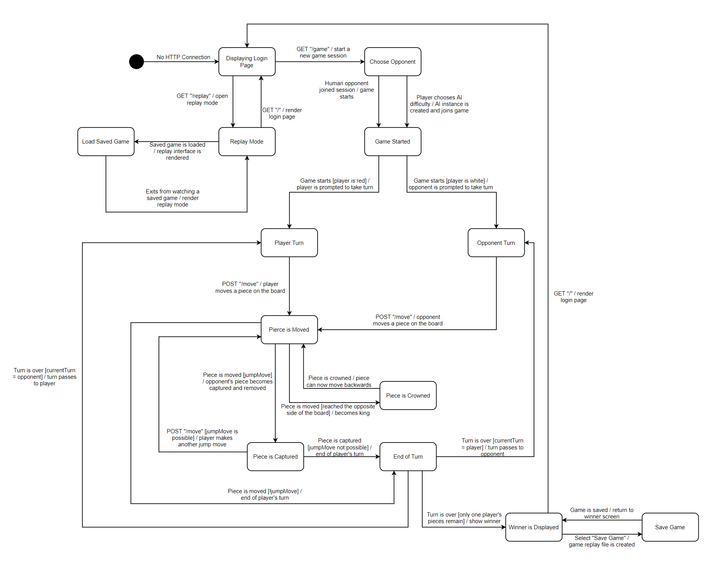

The user will begin their checkers experience on the Home page. They'll see "Welcome!" and a sign-in button.
They will click the button and go to the sign-in page which has a text box and a submit button to enter their name.
If the user enters an invalid name, they'll stay on the sign in page and be prompted to enter a new name. 

Once the user enters and submits a valid name, they will go back to the Home page, which will be updated now that the 
user is logged into the system. There will be a navigation bar with the tabs "myHome" and "sign out". If the user 
selects the sign out tab, they'll be directed to a page that'll ask them to confirm their choice. If they choose to sign 
out, they'll be directed back to the sign-in page. If, instead they choose to stay signed in, they'll return to their 
"myHome" page. 

On the myHome page, they will now see a list of all the PRs in the lobby (except themselves). Next to each
user's name, there is a button to start a game with that user. If the user chooses to initiate a checkers game with 
another currently logged in PR, they will click the "Start a Game" button near their desired OP's name. The 
selected OP will go to the GetGameRoute when their browser detects that someone chose to play they in a game. If 
OP is not already in a game, both users will be directed to a view of the game. This view includes a checkers board 
with pieces pre-placed on the board. There will be an Info Panel at the top left that will highlight the PR whose 
turn it is, and a Control Panel that will allow the PRs to undo a move, submit their move, or resign the game.

From here, a standard game of checkers will be played until one PR wins or resigns. After the game ends, the users will 
be returned to their respective myHome tabs. They'll be able to repeat the process and either choose a new OP 
or sign out.

### UI Tier

The most important aspect of any APP for the user is the UI Tier. The User only sees and interacts with what is 
on their screen, so it is of utmost importance for it to be top-notch! The UI Tier at the server side is nothing more 
than just text on a black screen, but that text is able to understand and respond to the user for an overall enjoyable
experience.

The tier begins with the WebServer class, which initialises the View Elements of the website by calling the appropriate 
HTTP Protocol handling class through Dependency Injection. What that means in English, is that WebServer is the stage 
upon which the game is set. The first class to be greet the user is the class that handles the Home page of the Online 
WebCheckers. The "GetHomeRoute" class is invoked, and the user is able to interact with the Home Page. 

When at the Home Page, the user has the ability to see the number of PRs online and currently playing the game, 
and can join them by using the Sign In option.

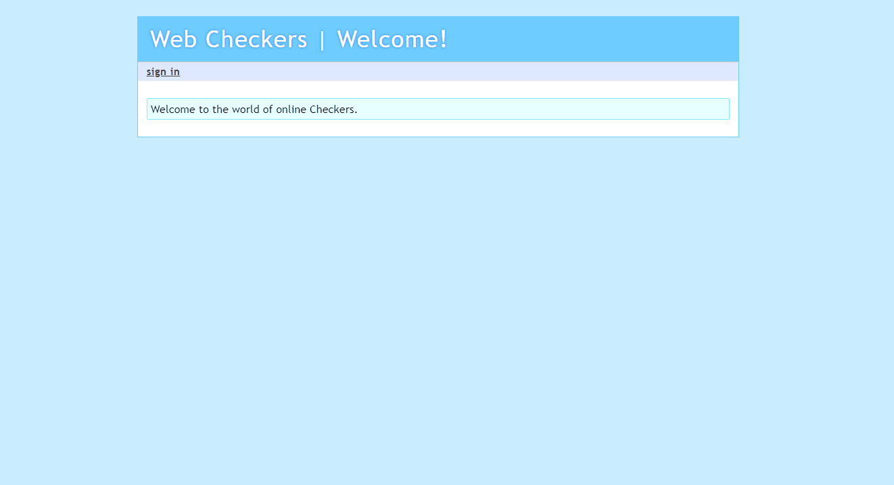 

Once they decide to Sign In, the WebServer then serves the SignIn page, handled by the "GetSignIn" class, to the user. 
Here the user has the ability to Log in using a valid name, which is checked by the APP, and can then join the 
PL.

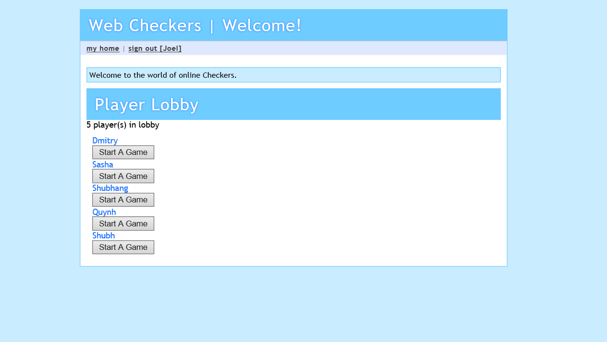  

The PL lets a PR choose their OP to play against, with clicking on the "Start A Game" button. 
Once the button is pressed, the APP begins to form a game session for the PRs, and the users can now play the game.

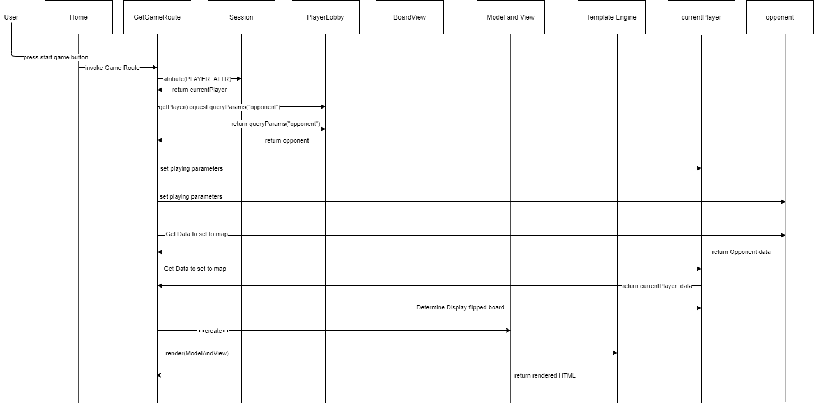

With the latest update, the Replay portion of the UI tier has been added to the program. This allows users to view all 
the moves in a previously completed game from any other PR in the session. The user can go forwards and backwards 
throughout all the moves until they are finished viewing the replay.
 
### Application Tier

The Application Tier of this APP consists of 3 components: Game, GameCenter, and PL.
A Game object represents a game event in the APP. It contains a "redPlayer" (a Player object that 
represents the user who interacts with the red pieces on the checker board), a "whitePlayer" (a Player object that
represents the user who interacts with the white pieces on the checker board), and an "id" (a unique number used to 
identify Game objects across multiple user sessions). The GameCenter component holds a PL object, "playerLobby", which 
is a collection of all the users logged into the webapp across all games. PL contains a structure "players" (a HashMap 
that maps each PR object to their name), and a GameCenter "gameCenter" that ties the lobby to a single GameCenter.

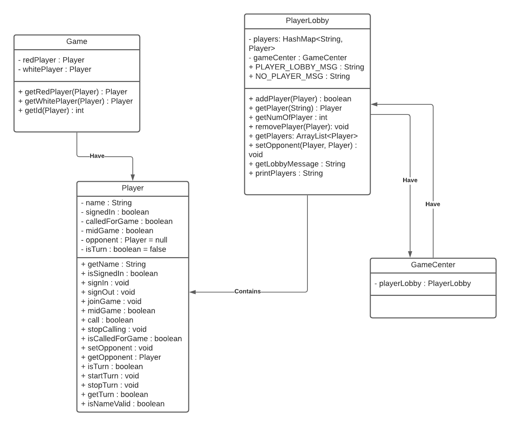

When the APP starts up, a GameCenter and a PL are both also constructed. These both store 
application-wide data. When PRs sign-in to the checkers app, they are added to the PL HashMap. The names
listed in the PL are the names saved in the PL object. This is the main responsibility of the PL: to hold a record of 
all the PR objects, and for ease of display, their names as Strings. Once a user can see the other signed-in users in 
the lobby, they can choose one to play a game against. Once the "Start a Game" button is pressed, and the request is 
validated, a new Game object is created. This Game object is responsible for representing a checker game, and it's PRs. 
Therefore, the user who initiates the game is assigned at the red PR, and the user that was chosen by the first user is 
then added to the game as the white PR. Both users' PR object representations are held in the Game object, and the 
unique id that allows the APP to differentiate different games as well as to tie users in different sessions to 
the same game.

Currently, the GameCenter is not used in full as designed. When multiple games are being held, all the Game instances 
and PRs will be held in the application-wide gameCenter. The gameCenter will then keep track of the wins and 
losses across the APP, the number of users and games, and other features like saved games, or the all-time user
with the highest number of wins. Currently, the design implemented does not include these planned responsibilities
of the GameCenter class.

### Model Tier

The Model Tier provides the game logic for the system. It takes the input from the UI tier and applies it to the inner
workings of the games. It brings the different attributes of the PRs and checkers game into one tier where they dictate
how both the game and PR select work. 

For the most important part of any game, the people who play it, there is the PR object. It holds various booleans 
determining what play states they are in, how they relate to their OPs, and the unique attributes each PR has. 

The PR need a checkerboard to play on. That's where BoardView comes in. BoardView acts as a representation of a 
checkerboard comprised of 8 rows of spaces. The spaces on each row have a color, and an indicator of whether there is a 
piece on it. These keep track of the board in the current game state.

Speaking of the pieces, the Piece class represents a checker piece including what color it is and if it is a king. 
Through the UI tier, the PRs move these pieces across the BoardView until someone wins. 

In order to maintain the good practice of High Cohesion and Low Coupling, the Player class does not directly interact 
with the BoardView, but rather serves a representation of the people who are playing the checkers game. The inputs from 
the UI are converted to the Move objects change the position  of pieces on the BoardView. The Move object has 2 Position 
objects, a denotation of the row and column of a change, one for the start and end of a piece movement. 

In our latest release, we added a feature to save replays of games to be viewed at a later time. The ReplaySaver class 
accomplishes this through saving replays as Replay objects, consisting of a list of ReplayMove objects. A Move and 
ActiveColor object comprises a ReplayMove to denote who did what move. Then, the Replay Object compiles all the moves in 
a game, with the PR who did them, and uses that to represent a replay of a game. There is also a move counter to show 
the number of the current move in a replay. The ReplayLoader class, then accesses these replays from the replay saver, 
and uses them to display a replay in the UI tier.

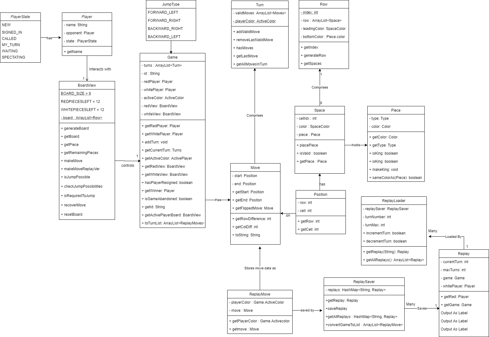

### Design Improvements

The main design improvements there are still to be made within the WebCheckers APP stem from the UI and Model
tiers. The Model tier is extensive and complicated by nature - it is the job of the developers to simplify this
component, which can definitely be done. Currently, the Player class has some overlapping functionality with the Game
class, which can be separated to conform to the Single-Responsibility Principle. 

Additionally, the Game class could contain much of the functionality from many UI components and Spark session 
attributes (such as storing the board, active color, etc.). Having this functionality housed inside of the newly added 
Game class would be more fitting as it would create greater cohesion throughout the program. 

A final design improvement can be made within the UI tier. Many handle() methods are simply too large to be read without 
extensive documentation - this situation would be a perfect place to include several Pure Fabrications - these classes 
or methods would serve as 'helper' constructs that have no presence in the domain of the APP, but would greatly improve 
the cohesion and readability of the program.

## Testing

### Acceptance Testing

We have passed all the user stories we set out to complete.

### Unit Testing and Code Coverage

Our Unit Testing strategy was to start with the Model classes then work our way up to the UI classes. This way,
we could incrementally test our code and use less mocks classes in the UI tests, allowing us to simulate the
exact behavior of the UI classes as they are used when the web APP is run. 

Our code coverage is currently 100% for the APP tier, 90% for the model tier and 35% for the UI tier. Our 
code coverage targets were 95-100% for the Model and APP tiers and 75-80% for the UI tier. This is because 
the tests for the Model and APP Tier were central to the business logic of the web APP. We held testing
to a higher standard for the classes in these tiers because they are essential for many of the features of the APP.

We reached our targets for both Model and APP tier, but in our results for the UI tier were an outlier. As a team, we 
struggled with testing the Routes, and some tests are absent. In the next release of the Checkers Web APP, these will 
be implemented.

## Analysis of Code Metrics

### Chiadamber-Kemeber Metric

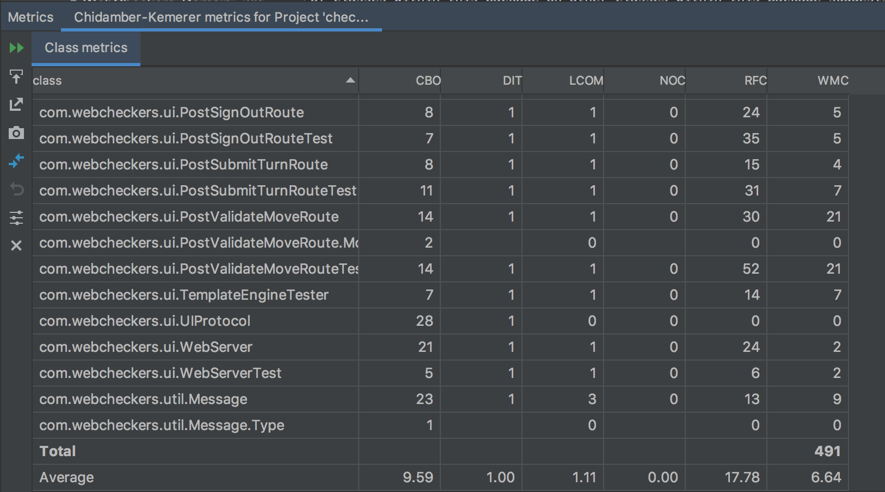

Weighted methods per class:

The weighted sum of complexities of all the methods in a class. The average weighted methods per class is 6.64. This means
that our WMC is relatively low and it is less prone to errors.

Depth of inheritance tree:

The maximum length of inheritance from a given class to its "root" class. The average depth of inheritance is 1.00 which
means that we have a lower design complexity and this correlates to our WMC value.

Number of children:

The number of immediate subclasses. The average number of children is 0.00 which means our project has a low use of
inheritance.

Coupling between object classes:

The number of object classes to which it is coupled. The average coupling between object classes is 9.59. This means that
there are high coupling in some classes such as Game and BoardView class. Which is why it was harder to test these
classes.

Response for a class:

The set of methods that will be involved in a response to a message to an object of this class. The larger the number
of methods that can be invoked from a class, the greater the complexity of the class and the harder it is to test.

Lack of cohesion in methods:

The count of the difference between the method pairs that are not similar and those that are similar within a given
class. The average lack of cohesion in methods is 1.11 which suggests the class is more cohesive.

### Complexity Metrics

Average Operation Complexity:

The average time complexity of all the functions in a class.

Cyclomatic Complexity:

The amount of paths there are to reach the end of a chunk of code's execution based on the number of splits in certain parts of the code
due to branches and the non-executed parts of loops

Weighted Method Complexity:

The cyclomatic complexity of the class’s methods

Essential Complexity:

Measures the number of entry points, termination points, and nondeductible nodes to determine how well a program is structured. 
The closer to 1 this value is, the more well-structured the program is.

Design Complexity:

The amount of dependencies a module relies on. The higher the design complexity, the more the module will seriously complicate the design of the program

### Javadoc Coverage Metric

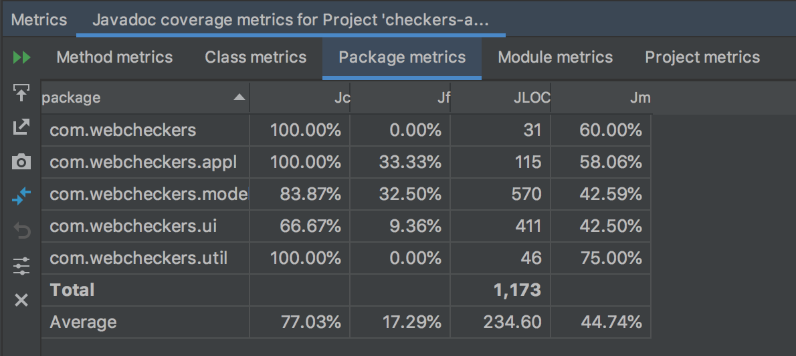

There were no violations for this test. Our average method javadoc lines of code was 2.07 with outliers ranging from
0-11. For the class metrics, our average class javadoc field coverage was 17.25% with outliers ranging from 0-100,
average for lines of code was 16.24 with outliers ranging from 0-76 and average for method coverage was 46.01% with
outliers ranging from 0-100. For the package metric, our average javadoc class coverage was 83.78%, javadoc field
coverage was 17.25%, javadoc lines of code was 240.40, and method coverage was 46.01%. For module metrics, the javadoc
lines of code was 1202. For the project metrics, the javadoc class coverage was 84.85%. Overall, we had high javadoc
coverage in our application and model tier. For the model tier, we had a lower javadoc coverage.

### Line of Code Metric

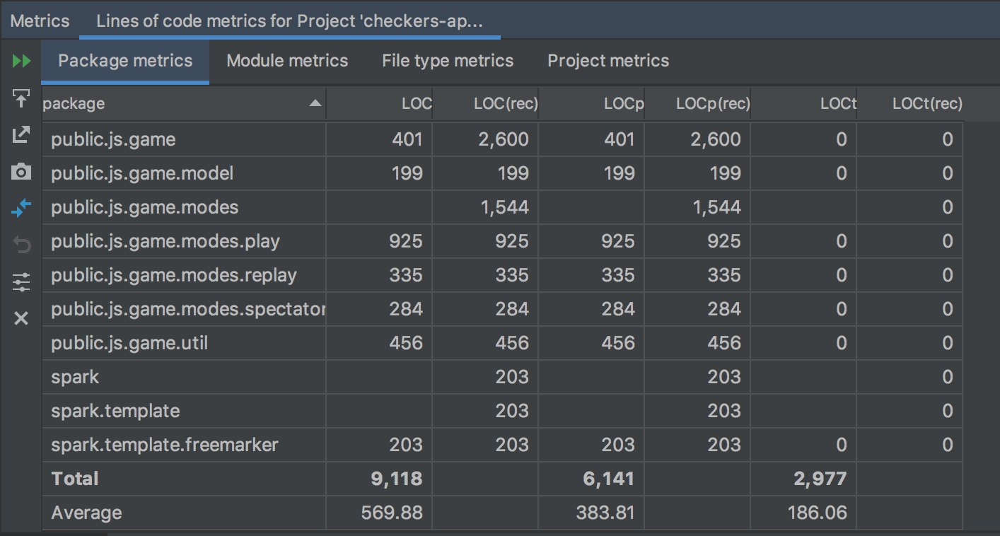

### Martin Package Metric

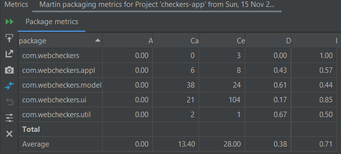
    
Afferent Coupling:

The amount of incoming dependencies to a class; a measurement of the sensitivity of remaining classes to changes made 
in a given class. The Model tier had the highest afferent coupling count at 38. Many Model tier classes build upon 
each other, i.e. a Turn object depends on a Move object, which in turn depends on 2 Position objects. The high reliance 
of classes within this package on other classes within this package suggests a tendency to expanding a single class's 
usability while resisting modification of the class's functionality.      

Efferent Coupling:

The number of classes in a given package which depend on classes in other packages. The UI tier had a 104 efferent 
coupling rating, which was a large outlier. Our UI tier is designed to conduct APP and game logic in the route 
handlers, which requires direct dependency on classes in the model and APP tiers.

Abstractness:

The degree of abstraction of a package. Each tier measured an abstraction of 0, meaning no abstraction was implemented 
in our design. This indicates that the classes in each of our packages are highly dependent on other packages.

Instability:
     
The relative susceptibility of a class to changes. The UI tier has a high instability of 1 while the Model and APP tiers 
have median instabilities. A high instability means the UI tier has many outgoing dependencies; therefore, it is more 
susceptible to change. This may again be explained by our design: the UI classes have varying behaviors that are reliant 
on the state of the many Model and APP package classes which are manipulated during the Checkers APP control flow. A 
median instability means the Model and APP classes are neither resistant nor susceptible to change. This a flaw in our 
design as it is preferred for components of a program to be either highly stable or highly unstable.
        
Normalized Distance from Main Sequence:

The balance between stability and abstractness. All three of our main packages measured a median value for distance 
from the main sequence. Ideally, this number should be as low as possible to indicate that the components of our 
program were located close to the main sequence. 
            
### Recommendations for Improvement

Improve the Stability of the Model and Application Tiers:

Ideally, all packages should be either highly stable or highly unstable. This way, there are only classes that are 
reliably resistant to change or classes that are reliably prone to change. There is less opportunity for a flaw in the 
logic when the classes prone to change are dependent on classes that are concrete and invariable.
    
Improve the Essential Cyclomatic Complexity of Select Model Tier Classes:

The BoardView class had multiple classes that were weak with respect to each complexity metric (cyclomatic, essential 
cyclomatic, and design). The essential cyclomatic complexity should be improved first because a low result in this 
indicates that the function or class was structured in such a way that is difficult to maintain, and/or is not modular. 
Functions with low ev(G) values are also difficult to refactor into smaller pieces of logic and is therefore incredibly 
difficult to test. In the case of the isJumpPossible() function, there was a large switch operation. There was a base 
condition that could be executed and contained before the switch; however, the method was structured to distribute this 
logic throughout the cases. It could not be easily broken down for testing. This structure also makes it more difficult 
to refactor the method to have a lower cyclomatic complexity (less nested conditionals with compound boolean cases), 
which hindered the ability to thoroughly test each path the large function could take. Rewriting this function would 
improve multiple complexities and the test coverage of this class.