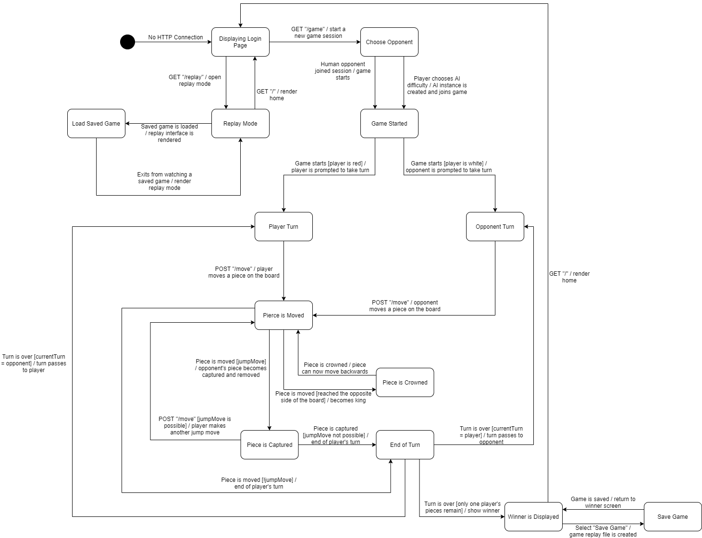

# PROJECT Design Documentation

> _The following template provides the headings for your Design
> Documentation.  As you edit each section make sure you remove these
> commentary 'blockquotes'; the lines that start with a > character
> and appear in the generated PDF in italics._

## Team Information
* Team name: s2a-Momo
* Team members
  * Shubhang Mehrotra (sm9943)
  * Joel Clyne (jmc4514)
  * Sasha Persaud (srp4581)
  * Quynh Duong (quynhnnduong)
  * Dmitry Selin (des3358)

## Executive Summary

The Online WebCheckers project is a Web-based application which aims to provide its users with the functionality to play 
checkers online and in real-time, against any other online player. 
To achieve the functionality, the system has been designed on Spark Framework with a FreeMarker Template. 
The bedrock of the application is formed of Java, Javascript, HTML and CSS 

### Purpose
> _Provide a very brief statement about the project and the most
> important user group and user goals._

This projects aims to bring a fun checkers experience to people who want to play the classic game over the internet 

### Glossary and Acronyms
> _Provide a table of terms and acronyms._

| Term | Definition |
|------|------------|
| VO | Value Object |
| PR | Player |
| OP | Opponent |

## Requirements

This section describes the features of the application.

> _In this section you do not need to be exhaustive and list every
> story.  Focus on top-level features from the Vision document and
> maybe Epics and critical Stories._

Users can sign in with their name and search for other players.
Play a complete game of checkers, displaying everything like a physical game.

### Definition of MVP
> _Provide a simple description of the Minimum Viable Product._

* Users can sign in with a unique name
* People will play checkers according to the american rules
* The enitre chess board will look like a physical game of chess

### MVP Features
> _Provide a list of top-level Epics and/or Stories of the MVP._
* Connection
* Sign-In
* Possible Move
* Display

### Roadmap of Enhancements
> _Provide a list of top-level features in the order you plan to consider them._

* Replay mode to save replays to txt files, and read them later for viewing
* AI Opponent with 2 selectable difficulty levels for solo players

## Application Domain

This section describes the application domain.

> _Provide a high-level overview of the domain for this application. You
> can discuss the more important domain entities and their relationship
> to each other._

## Architecture and Design

This section describes the application architecture.

### Summary

The following Tiers/Layers model shows a high-level view of the webapp's architecture.

As a web application, the user interacts with the system using a
browser.  The client-side of the UI is composed of HTML pages with
some minimal CSS for styling the page.  There is also some JavaScript
that has been provided to the team by the architect.

The server-side tiers include the UI Tier that is composed of UI Controllers and Views.
Controllers are built using the Spark framework and View are built using the FreeMarker framework.  The Application and Model tiers are built using plain-old Java objects (POJOs).

Details of the components within these tiers are supplied below.

### Overview of User Interface

This section describes the web interface flow; this is how the user views and interacts
with the WebCheckers application.

> _Provide a summary of the application's user interface.  Describe, from
> the user's perspective, the flow of the pages in the web application._

### UI Tier
> _Provide a summary of the Server-side UI tier of your architecture.
> Describe the types of components in the tier and describe their
> responsibilities.  This should be a narrative description, i.e. it has
> a flow or "story line" that the reader can follow._

The user will begin their checkers experience on the GetHomeRoute. They will click the button and go to
GetSignInRoute which has a text box and submit button to enter their name. Once the user enters and submits
a valid name, they will go to the postSignInRoute where they will now be logged into the system. Then, the user
will click the myHome link to return to the GetHomeRoute where they will now see a list of all the players in the lobby
except themselves, and other players will be able to see that user.
If the user chooses to initiate a chess game with another currently logged in player, they will click the name of their 
desired opponent and proceed to the GetGameRoute. The selected opponent will go to the GetGameRoute when their browser 
detects that someone chose to play they in a game. Once both players are in the GetGameRoute, the will play a game of 
chess going through (INSERT ROUTES HERE) until someone wins where they will go to the (INSERT ENDGAME ROUTE HERE). After 
both players are finished, they will be returned to the GetHomeRoute where they can plck another user to play against.
If the player is finished, they can click on the signOut link to sign out and go to the (INSERT SIGN OUT ROUTE HERE).

> _At appropriate places as part of this narrative provide one or more
> static models (UML class structure or object diagrams) with some
> details such as critical attributes and methods._

> _You must also provide any dynamic models, such as statechart and
> sequence diagrams, as is relevant to a particular aspect of the design
> that you are describing.  For example, in WebCheckers you might create
> a sequence diagram of the `POST /validateMove` HTTP request processing
> or you might show a statechart diagram if the Game component uses a
> state machine to manage the game._

> _If a dynamic model, such as a statechart describes a feature that is
> not mostly in this tier and cuts across multiple tiers, you can
> consider placing the narrative description of that feature in a
> separate section for describing significant features. Place this after
> you describe the design of the three tiers._

### Application Tier
> _Provide a summary of the Application tier of your architecture. This
> section will follow the same instructions that are given for the UI
> Tier above._

The application tier consists of the PlayerLobby and GameCenter. The PlayerLobby manages player sign in and 
the status of all players (in game , waiting for game) including the amount of total concurrently logged in players.
It can add and remove players with sign in and sign out respectively. It also records which players are playing 
against each other.  

### Model Tier
> _Provide a summary of the Application tier of your architecture. This
> section will follow the same instructions that are given for the UI
> Tier above._

### Design Improvements
> _Discuss design improvements that you would make if the project were
> to continue. These improvement should be based on your direct
> analysis of where there are problems in the code base which could be
> addressed with design changes, and describe those suggested design
> improvements. After completion of the Code metrics exercise, you
> will also discuss the resutling metric measurements.  Indicate the
> hot spots the metrics identified in your code base, and your
> suggested design improvements to address those hot spots._

## Testing
> _This section will provide information about the testing performed
> and the results of the testing._

### Acceptance Testing
> _Report on the number of user stories that have passed all their
> acceptance criteria tests, the number that have some acceptance
> criteria tests failing, and the number of user stories that
> have not had any testing yet. Highlight the issues found during
> acceptance testing and if there are any concerns._

### Unit Testing and Code Coverage
> _Discuss your unit testing strategy. Report on the code coverage
> achieved from unit testing of the code base. Discuss the team's
> coverage targets, why you selected those values, and how well your
> code coverage met your targets. If there are any anomalies, discuss
> those._
